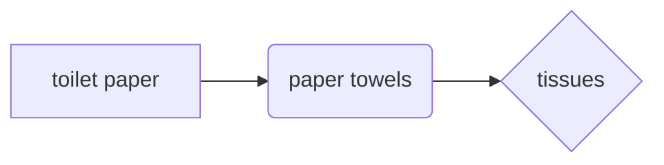

## abbr.

`SoK`:Systematization of Knowledge Papers 

`i.e.`:id est，that is

## hygiene

> dine and dash & smash and grab burglaries

## culture

> Chinese polite-fight 
>
> you're never supposed to give in.
>
> these things can get hell intense.
>

## expression

> choice paralysis
