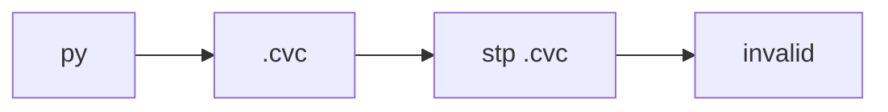

## Week2
> present按照bit是因为适合硬件实现。
> 注意从左到右是63bit到0bit，我们在实现的时候把0bit放在最低位（pt[0])，可以把1bit放到一个字节去存。
>
> （会导致是S[0]S[1]S[2]S[3]或者S[3]S[2]S[1]S[0]）
>
> cp -rf hukai zhangsancdcp


需要换源自己的git仓库

```
git remote rm origin
git remote add origin git@gitee.com:bbeehappy-time/cryptographic-experiments.git   
git push origin master  
```


被fork的仓库更新了

```
git remote add upstream http...
git fetch upstream
git merge upstream/master
```


github被拒绝

```
cd ..
cd deps/
ls
# 所有都换成GitHubfast
```


提交pull request，如果把自己的commit push到仓库中，pull request也会相应更新。

## Week 3

### STP 




## Week 4

skinny & AES 比较

|          | skinny       | aes                                      |
| -------- | ------------ | ---------------------------------------- |
| 操作     | nible        | byte                                     |
| MC       | 没有域乘操作 | 有                                       |
| 密钥扩张 | 纯线性       |                                          |
| 首尾轮   | 全部一致     | 末轮去掉MC，使得加解密能使用相似的组件。 |

线性分析的**基础**：轮的独立性假设

路线的列对称指的是输入输出掩码都可以按照列的方向移动且是对应的